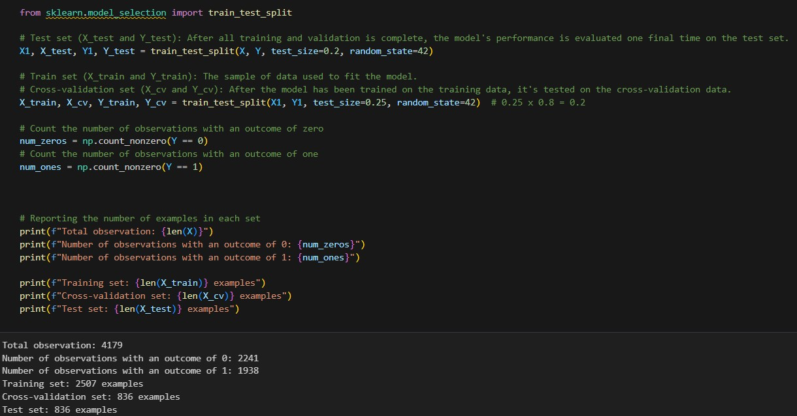
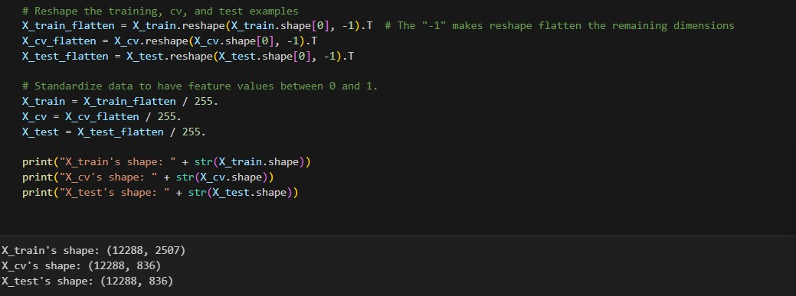
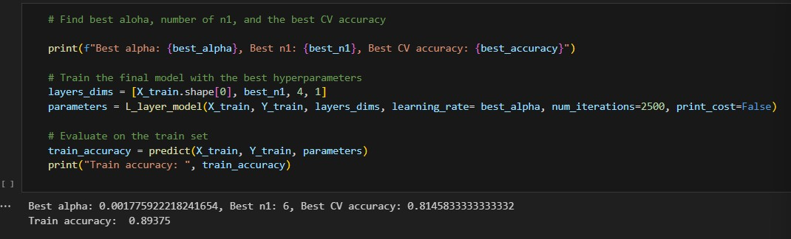

# 📌 Project Background  
This project aims to develop an automated system for classifying fruits as fresh or rotten using deep learning techniques. With over 4000 images in the dataset, the system will leverage convolutional neural networks to analyze visual features and determine fruit freshness. This approach addresses the challenge of efficient quality control in the food industry, potentially reducing food waste and improving consumer satisfaction. By automating the classification process, the project seeks to overcome the limitations of time-consuming and subjective manual inspections, offering a more consistent and scalable solution for fruit quality assessment.
[dataset](https://www.kaggle.com/datasets/swoyam2609/fresh-and-stale-classification/data).

<i>In collaboration with Vincent Lee, Wenchi Tseng, Wei Chen, I-Ching Lu, and Zihang Sun.</i>

# 🧐 Data Overview  
This dataset contains 4000+ images, each in one of the following categories:  
- fresh
- rotten

The outcome variable is binary (1 for fresh and 0 for rotten). Images in the "apple-fresh" or "banana-fresh" groups are considered fresh, whereas images in the "apple-rotten" or "banana-rotten" groups are considered rotten. 50% of the images in this dataset have an outcome of 1, or fresh.

# 🕹️ Data Processing  
To pre-process the data, we did data partitioning, image processing, and normalization. 
- Data partitioning to split the images into three datasets, 60% in training, 20% in cross-validation, and the remaining 20% in testing. This resulted in 2507 images in the training set and 836 images in each of the cross-validation and testing sets.
   
    
      
- Image processing to resize each of the images to 64 pixels x 64 pixels and to add the 0 and 1 labels to the images.  
   
    
     
- Normalizing the images by scaling the features to be between 0 and 1, making the data more interpretable.  
   
    
     

# 🔍 Evaluation of Models  
The evaluation metric we used was accuracy. Not only is accuracy easy to explain, but overall model correctness is crucial in this context. Misclassifying a rotten fruit as fresh could lead to quality control issues and potential health risks for consumers, while misclassifying fresh fruits as rotten could result in unnecessary food waste and economic losses. In general, humans can visually identify whether a fruit is fresh or rotten with high reliability, so the human error is close to 0%, meaning that our goal should be to aim for high accuracy.

We tried building two NN models without TensorFlow, one with 2 hidden layers (7 nodes in hidden layer 1 and 4 nodes in hidden layer 2), and the other one with Random Search. The Random Search returned the best results with Best n1 of 6, a training accuracy of 89.4%, and a cross-validation accuracy of 81.5%.
   
    
     
    
    
    

We used the Tensorflow package to try to run the dataset through different models to see if they would provide better results. Some algorithms and techniques we tried included:   
- Adam (Adaptive Moment Estimation)
- RMSprop
- SDG
- Adadelta
- Changed Hidden Layer from 6 hidden units to 20
- L2 Regularization
- Dropout
- Early Stopping
- Weight Initializations
    - Random Uniform
    - He Uniform
    - Orthogonal
- Batch Normalizations
- Custom Momentum
- Custom Epsilon
- Custom Beta & Gamma Initializer

In conclusion, the best model was Batch Normalizations (Training Accuracy: 92.06%, Validation Accuracy: 90.31%, Test Accuracy: 89.11%).

# 🖊️ Project Conclusion

Our deep learning project for classifying fruits as fresh or rotten has yielded promising results. Through extensive experimentation with various neural network architectures and optimization techniques, we have developed a model that effectively distinguishes between fresh and rotten fruits using image data. The use of convolutional neural networks and advanced techniques such as batch normalization have proven effective in capturing the visual features necessary for accurate classification.
Key achievements:
- Successfully processed and utilized a dataset of over 4000 images.
- Implemented effective data preprocessing techniques, including resizing and normalization.
- Explored multiple model architectures and optimization strategies.
- Achieved high accuracy in fruit freshness classification, crucial for practical applications in quality control.

# ☁️ Project Improvements

- Fine-tune hyperparameters: Conduct more extensive hyperparameter tuning to optimize model performance further.
- Enhance interpretability: Implement techniques like Grad-CAM to visualize which parts of the image the model focuses on for its decisions.
